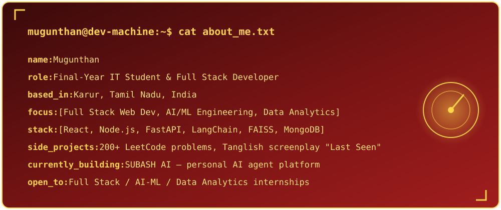
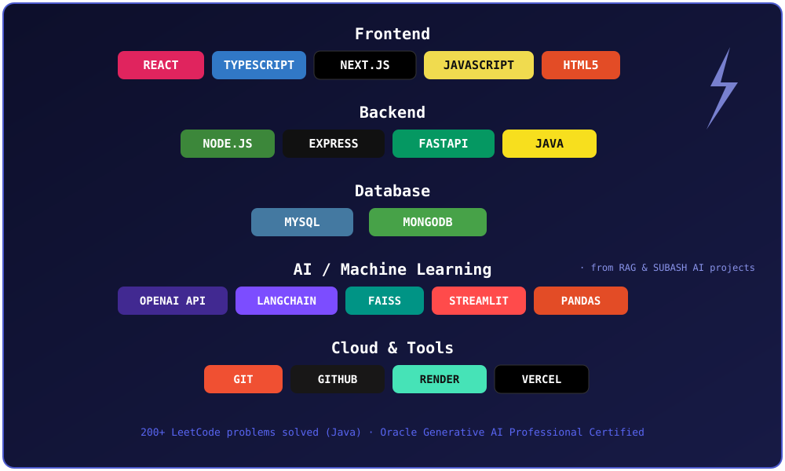
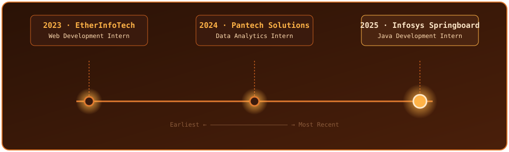

<h1>Hi, I'm Mugunthan 👋</h1>
<h3>Final-Year IT Student · Full Stack Developer · AI/ML Enthusiast</h3>

 

 

## 🖥️ whoami

  

 

## 🛠️ Tech Stack

  

 

## 💼 Experience

  

 

🟡 **Java Development Intern — Infosys Springboard**

Hands-on Java development internship building core Java applications and OOP-based solutions.

`Java` `OOP` `Core Development`

🔵 **Data Analytics Intern — Pantech Solutions**
Worked on data cleaning, visualization, and reporting → `Python` `Pandas` `Power BI`

🔵 **Web Development Intern — EtherInfoTech**
Built and maintained full stack web application features → `HTML/CSS` `JavaScript` `Web Development`

**🎓 B.Tech Information Technology** — VSB Engineering College, Karur, Tamil Nadu (CGPA 7.8, Expected 2027)
**📜 Certified:** Oracle Generative AI Professional · IIT Gwalior Project Certificate

 

## 🎨 Featured Projects

|                                             |                                                                   |                                              |
| ------------------------------------------- | ----------------------------------------------------------------- | -------------------------------------------- |
| 🤖 **SUBASH AI**                            | Large-scale personal AI agent platform with modular architecture  | `FastAPI` `React` `Python`                   |
| 🌱 **GreenFlow Smart Irrigation Manager**   | Smart irrigation management system, deployed on Render            | `React` `TypeScript` `Node.js`               |
| 📚 **RAG AI Knowledge Assistant**           | Retrieval-augmented generation chatbot over custom knowledge base | `LangChain` `FAISS` `OpenAI API` `Streamlit` |
| 📋 **Job/Internship Application Tracker**   | Full stack MERN app to track internship & job applications        | `MongoDB` `Express` `React` `Node.js` `JWT`  |
| 📊 **Sales & Retail Performance Dashboard** | Interactive analytics dashboard for sales/retail performance      | `Python` `Pandas` `Power BI`                 |
| 🌐 **Personal Portfolio**                   | Dark-themed personal portfolio site with smooth animations        | `React` `Next.js` `Framer Motion`            |

 
## 📊 GitHub Analytics

  

  

 

## 🏆 GitHub Trophies

 

## 📈 Contribution Calendar

 

## 📋 GitHub Profile Summary

  

  

 

## 💻 Coding Profiles

 

## 🎯 2026 Goals

- 🚀 Build 20+ Production Ready Projects
- 🤖 Master AI Agents & Generative AI
- 🌍 Contribute to Open Source
- 💼 Secure a Product-Based Software Role
- ☁ Learn AWS & Cloud Architecture
- 📱 Develop Cross-Platform Applications
- 📊 Reach 1000+ GitHub Contributions
- 🏆 Earn More Industry Certifications

 

## ☕ Support My Work

If you like my projects,

⭐ Star my repositories

🍴 Fork them

🤝 Contribute

💙 Follow my GitHub journey

 

## 🧊 3D Contribution Graph

 

## 🐍 Contribution Snake

<picture>
  <source media="(prefers-color-scheme: dark)" srcset="https://raw.githubusercontent.com/Mugunthandk/Mugunthandk/output/github-contribution-grid-snake-dark.svg">
  <source media="(prefers-color-scheme: light)" srcset="https://raw.githubusercontent.com/Mugunthandk/Mugunthandk/output/github-contribution-grid-snake.svg">
  
</picture>

 

📫 **Reach me:** [mugunthandk@gmail.com](mailto:mugunthandk@gmail.com) · [LinkedIn](https://www.linkedin.com/in/mugunthan-dk)

 

